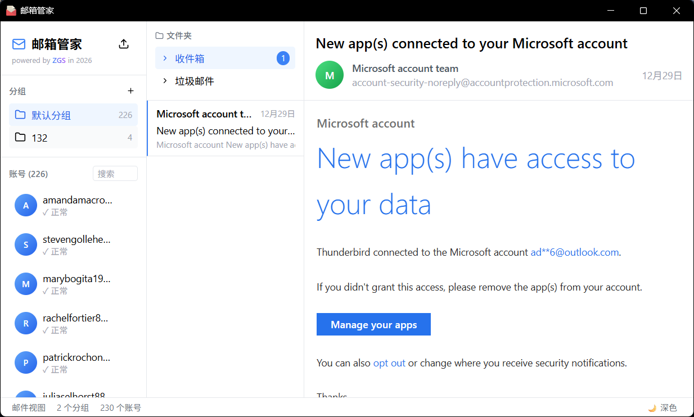
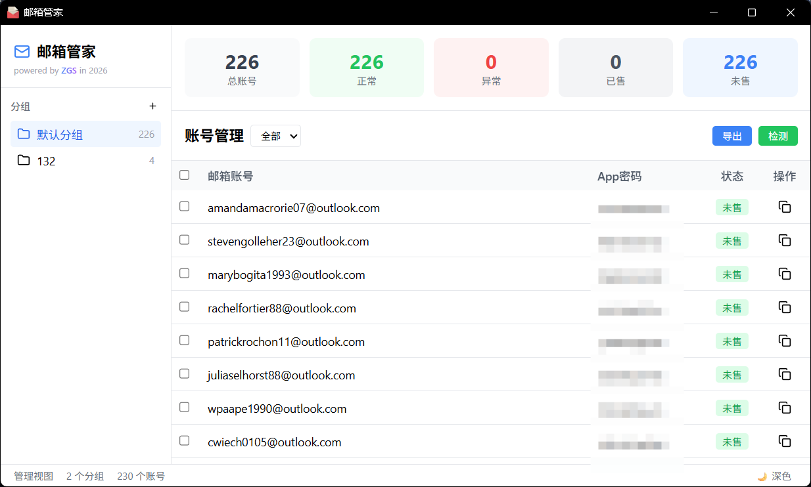

# 邮箱管家 (Outlook Mail Manager)

一款基于 Wails 构建的 Outlook 邮箱批量管理桌面应用，支持多账号管理、邮件查看、分组管理等功能。


## 截图预览

### 邮件视图
<!-- 在此处插入邮件视图截图 -->


### 管理视图
<!-- 在此处插入管理视图截图 -->


### 深色模式
<!-- 在此处插入深色模式截图 -->


## 功能特性

- **多账号管理**
  - 批量导入 Outlook 账号
  - 支持分组管理账号
  - 批量检测账号 Token 有效性
  - 批量删除、移动账号

- **邮件查看**
  - 查看收件箱、垃圾邮件等文件夹
  - 支持邮件分页加载
  - 查看邮件详情和 HTML 正文
  - 附件下载支持

- **分组管理**
  - 创建、删除分组
  - 账号拖拽分组
  - 分组账号导出

- **界面特性**
  - 双视图切换（邮件视图 / 管理视图）
  - 深色模式支持
  - 响应式布局

## 技术栈

| 层级 | 技术 |
|------|------|
| 框架 | [Wails v2](https://wails.io/) |
| 后端 | Go 1.21+ |
| 前端 | Vue 3 + TypeScript |
| 状态管理 | Pinia |
| 样式 | Tailwind CSS |
| 图标 | Lucide Icons |
| 数据库 | SQLite |
| API | Microsoft Outlook REST API v2.0 |

## 系统要求

- Windows 10/11
- WebView2 Runtime（Windows 11 已内置）

## 快速开始

### 下载安装

从 [Releases](https://github.com/vag-Zhao/Outlook-Mail-Manager/releases) 页面下载最新版本的 `邮箱管家.exe`，双击运行即可。

### 从源码构建

#### 前置条件

- [Go 1.21+](https://golang.org/dl/)
- [Node.js 18+](https://nodejs.org/)
- [Wails CLI](https://wails.io/docs/gettingstarted/installation)

```bash
# 安装 Wails CLI
go install github.com/wailsapp/wails/v2/cmd/wails@latest
```

#### 构建步骤

```bash
# 克隆仓库
git clone https://github.com/vag-Zhao/Outlook-Mail-Manager.git
cd Outlook-Mail-Manager

# 开发模式运行
wails dev

# 构建生产版本
wails build
```

构建完成后，可执行文件位于 `build/bin/邮箱管家.exe`

## 使用说明

### 导入账号

点击左上角的导入按钮，粘贴账号数据，支持以下格式：

```
邮箱----密码----ClientID----RefreshToken
```

或使用 Tab 分隔：

```
邮箱	密码	ClientID	RefreshToken
```

### 账号格式说明

| 字段 | 说明 |
|------|------|
| 邮箱 | Outlook 邮箱地址 |
| 密码 | 邮箱密码（可选，仅用于记录） |
| ClientID | Azure AD 应用的 Client ID |
| RefreshToken | OAuth2 Refresh Token |

### 获取 RefreshToken

需要通过 Azure AD 应用授权获取 RefreshToken，具体步骤：

1. 在 [Azure Portal](https://portal.azure.com/) 注册应用
2. 配置重定向 URI 和 API 权限
3. 通过 OAuth2 授权流程获取 RefreshToken

## 项目结构

```
outlook-mail-manager/
├── app.go                 # 应用核心控制器
├── main.go                # 程序入口
├── wails.json             # Wails 配置
├── internal/
│   ├── database/
│   │   └── sqlite.go      # SQLite 数据库
│   ├── models/
│   │   ├── account.go     # 账号模型
│   │   └── mail.go        # 邮件模型
│   ├── services/
│   │   ├── account_service.go  # 账号服务
│   │   ├── group_service.go    # 分组服务
│   │   ├── graph_service.go    # Outlook API 服务
│   │   └── token_service.go    # Token 服务
│   └── utils/
│       └── parser.go      # 解析工具
└── frontend/
    ├── src/
    │   ├── App.vue        # 主组件
    │   ├── main.ts        # 前端入口
    │   ├── stores/
    │   │   ├── account.ts # 账号状态管理
    │   │   └── mail.ts    # 邮件状态管理
    │   └── lib/
    │       └── utils.ts   # 工具函数
    ├── index.html
    └── vite.config.ts
```

## 安全说明

- 所有账号数据存储在本地 SQLite 数据库中
- RefreshToken 等敏感信息仅存储在本地
- 应用不会上传任何数据到第三方服务器

## 开源协议

本项目采用 [MIT License](LICENSE) 开源协议。

## 作者

**ZGS** - [zgs3344@hunnu.edu.cn](zgs3344@hunnu.edu.cn)

## 致谢

- [Wails](https://wails.io/) - 优秀的 Go + Web 桌面应用框架
- [Vue.js](https://vuejs.org/) - 渐进式 JavaScript 框架
- [Tailwind CSS](https://tailwindcss.com/) - 实用优先的 CSS 框架
- [Lucide](https://lucide.dev/) - 精美的开源图标库

---

如果这个项目对你有帮助，欢迎 Star 支持！
